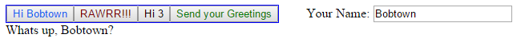

"*Modular, composable web components. Modular, composable styles.*"


Gem.js is a view library - a set of extensible web components for building visual user interfaces and styling web applications
in pure-javascript.

The power of functions and variables is unparalleled, and yet languages like HTML and CSS, which don't have any ability to compose
structures together, are still the primary ways people build web applications. Framework after framework has come along to try and
solve the problem of making web pages dynamic. Angular, Backbone, Ember, jQuery, mooTools, Dojo, YUI, etc have all tried to be
everything to everyone. But what they fail at providing is simplicity and modularity. They end up with bloated libraries filled with
features you're not using.

Gem.js is here to change that. Finally, modern application development for the browser!


<!-- START doctoc generated TOC please keep comment here to allow auto update -->
<!-- DON'T EDIT THIS SECTION, INSTEAD RE-RUN doctoc TO UPDATE -->

- [Example](#example)
- [Why use `Gem.js`?](#why-use-gemjs)
- [Comparisons](#comparisons)
- [Install](#install)
- [Usage](#usage)
  - [`Gem`](#gem)
    - [Static properties and methods](#static-properties-and-methods)
    - [Instance properties and methods](#instance-properties-and-methods)
      - [Event instance properties and methods](#event-instance-properties-and-methods)
        - [`ifon`](#ifon)
        - [`proxy`](#proxy)
    - [Instance events](#instance-events)
      - [Dom Events](#dom-events)
  - [Custom Gems](#custom-gems)
    - [Releasing custom gems as separate modules](#releasing-custom-gems-as-separate-modules)
    - [Inheriting from Gems with a class library other than `proto`](#inheriting-from-gems-with-a-class-library-other-than-proto)
    - [Inheriting from Gems without a class library](#inheriting-from-gems-without-a-class-library)
  - [Standard Gems](#standard-gems)
    - [Conventions](#conventions)
    - [Button](#button)
    - [Canvas](#canvas)
    - [CheckBox](#checkbox)
    - [Block](#block)
    - [Image](#image)
    - [List](#list)
    - [Radio - Not a `Gem`](#radio---not-a-gem)
    - [Select](#select)
    - [Svg](#svg)
    - [Table](#table)
    - [Text](#text)
    - [TextArea](#textarea)
    - [TextField](#textfield)
  - [`Style` objects](#style-objects)
    - [`Style` constructor](#style-constructor)
      - [`<cssPropertyName>`](#csspropertyname)
      - [`$setup` and `$kill`](#setup-and-kill)
      - [`$state`](#state)
      - [`<GemName>`](#gemname)
      - [`$<label>`](#label)
      - [`$$<pseudoclass>`](#pseudoclass)
      - [`$inherit`](#inherit)
      - [Combining them together](#combining-them-together)
    - [`styleObject.mix`](#styleobjectmix)
    - [`styleObject.copy()`](#styleobjectcopy)
    - [`Style.addPseudoClass`](#styleaddpseudoclass)
    - [`styleObject.toString`](#styleobjecttostring)
    - [`Style.fromString`](#stylefromstring)
    - [`styleObject.toObject`](#styleobjecttoobject)
    - [Standard Pseudoclasses](#standard-pseudoclasses)
    - [Built-in JS Rendered Pseudoclasses](#built-in-js-rendered-pseudoclasses)
    - [Default style](#default-style)
  - [Tips and Recommendations](#tips-and-recommendations)
    - [Don't Create a node until you need it](#dont-create-a-node-until-you-need-it)
  - [Other Gem Modules](#other-gem-modules)
- [Decisions](#decisions)
- [What `Gem.js` is ***not***](#what-gemjs-is-not)
- [Contributors](#contributors)
- [Todo](#todo)
- [Changelog](#changelog)
- [How to Contribute!](#how-to-contribute)
- [License](#license)

<!-- END doctoc generated TOC please keep comment here to allow auto update -->

Example
=======

```javascript
var Button = require("gem/Button")
var Style = require("gem/Style")
var Block = require("gem/Block")

var list = Block()
;[1,2,3].forEach(function(n) {
    var text = "Hi "+n
    var toggleButton = Button(text) // create a button

    // make it do stuff when you click on it
    toggleButton.on('click', function() {
        if(toggleButton.text !== "RAWRR!!!") {
            toggleButton.text = "RAWRR!!!"
            toggleButton.state.set('color', 'rgb(128, 0, 0)')
        } else {
            toggleButton.text = text
            toggleButton.state.set('color', 'black')
        }
    })

    // add the button to the list
    list.add(toggleButton)
})

var greet = Button("send", "Send your Greetings") // labels like 'send' can differentiate
                                                  // otherwise identical types of gems
list.add(greet)

// create styles with style objects ..
list.style = Style({
    border: '1px solid blue', // .. that use familiar css values,
    marginRight: 34,          // .. camelCase css properties and integers interpreted
                              //    as "px" values when appropriate,

    Button: {                 // .. sub-gem styles,
        $$firstChild: {       // .. pseudo-class styles,
            color: 'rgb(0,100,240)',
        },
        $state: function(state) { // .. more sophisticated styling techniques
            return Style({
                color: state.color
            })
        }
    },
    $send: {              // .. style based on an object's label, and ..
        color: 'green'
    }
})

// append the list of buttons to the document body (so it shows up)
list.attach()


// custom gems (use your favorite javascript class library - here proto is being used)
var NameInput = proto(Gem, function() { // inherit from Gem
    this.name = 'NameInput'
    this.build = function(LabelText) {  // the `build` method initializes the custom Gem
        this.nameField = TextField()
        this.add(Text(LabelText), this.nameField)
        this.nameField.on('change', function() {
            list.children[0].text = "Hi "+this.val
        })
    }
})

var nameInput = NameInput("Your Name: ")
greet.on('click', function() {
    var text = Text("Whats up, "+nameInput.nameField.val+'?')
    text.style = Style({display:'block'})
    text.attach()
})
nameInput.attach()
```

[](https://cdn.rawgit.com/Tixit/Gem.js/master/example/example.html)

If anything in the documentation is unclear, or you want to see more examples, [the unit tests](https://github.com/Tixit/Gem.js/tree/master/src/test) give a comprehensive and exhaustive set of examples to look at.

Why use `Gem.js`?
====================

* Makes your web application **easier to develop** with modular reusable structure objects (`Gem` objects) *and* `Style` objects
* **No HTML Needed**. With `Gem.js`, you write in 100% javascript. The only html requirement is a `document` `body`. You can still add plain old HTML into your gems using `gem.domNode.innerHTML` tho if you so choose.
* **No CSS Needed**. While Gem.js uses css style properties, it rejects the cascading nature of css, allowing one style to be fully isolated from another. No more wondering which selector in which stylesheet botched your nice clean style.
* **Works with your HTML and CSS**. `Gems` can be added as a child to any standard dom object and they can be styled with standard css stylesheets if you so choose.
* **Works with your current javascript**. `Gems` give you direct access to their `domNode` so you can use the dom manipulation libraries you're used to.
* **Fully separate style from structure**. By using [`$state`](#state), [`$setup`, and `$kill`](#setup-and-kill) javascript in your `Style` objects, you can include any javascript that is stylistic rather than structural.
* Import `Gem` modules with real APIs that anyone can release online. HTML snippets are so 1995.
* Lowers your risk of Cross-Site scripting. Data in Gem.js doesn't need to be escaped, and so you can cross that off your worry-list.
* Unlike [HTML web components](http://robdodson.me/why-web-components/), `Gem.js` **works in modern browsers without polyfills**.
* Also unlike HTML web components, [element name collision](https://groups.google.com/forum/#!topic/polymer-dev/90Dq_2bk8CU) isn't a problem.
* Has a small footprint: **16.5KB minified and gzipped in umd format**

Comparisons
===========
* See [the comparison to React](https://github.com/Tixit/Gem.js/wiki/Comparison-to-React)

Install
=======

```
npm install gem
```

or download the built package `Gem.umd.js` from the 'dist' folder in the repository

Usage
=====

```javascript
var Gem = require('gem')  // node.js and webpack

define(['Gem.umd.js'], function(gem) { ... } // amd

<script src="Gem.umd.js"></script>
<script>
  Gem; // global 'Gem' module object
</script>

```

`Gem`
------

All gems inherit from `Gem` - the basic building-block of the system. Gems are [EventEmitters](http://nodejs.org/api/events.html), and emitting events is one of the primary ways gems should communicate.

`Gem` is abstract and can't be instantiated on its own. See the section ''Custom Gems'' for details on how to create objects that inherit from Gem.

### Static properties and methods

**`Gem.name`** - The name of the Gem. Used both for naming dom elements for view in browser dev tools and for styling.

**`Gem.attach(listOfGems)`** - Appends the passed gems to `document.body`. IMPORTANT: only attach a gem to the dom via
this `attach` function or a gem's `attach`/`attachBefore` method. Without this, styles won't be rendered. \
**`Gem.attach(domNode, listOfGems)`** - Appends the passed gems to the passed `domNode`. \
**`Gem.attachBefore(domNode, listOfGems)`** - Appends the passed gems before the passed `domNode` as a sibling.

**`Gem.detach(listOfGems)`** - Removes the passed gems from their respective dom parents.

**`Gem.createBody(callback)`** - Dynamically creates the body tag. Calls `callback` when done.

**`Gem.dev`** - (Default: false) - When set to true, certain debugging feature are enabled.

### Instance properties and methods

**`gem.parent`** - The Gem's parent (which will also be a Gem) \
**`gem.children`** - An array of the Gem's children (which will all be Gems themselves). \
**`gem.domNode`** - The Gem's standard dom node object. \
**`gem.label`** - A string used for styling. Should be set once when the object is instantiated, and cannot change. *See the section on `Style` objects for details about how this is used*. \
**`gem.excludeDomEvents`** - A set of dom events to exclude from automatic registration. Will have the structure `{eventName1:1, eventName2:1, ...}`. See the documentation for `on` for more details. \
**`gem.state`** - An [observer](https://github.com/Tixit/observe) object that can be listened on for changes. Can be used for any purpose, but is intended for being used to create dynamically changing styles. *See the section on `Style` objects for an example*.

**`gem.add(gem, gem, ...)`** - Appends gems as children to the calling gem. This causes the domNodes of the passed gems to be appended to the calling gem's dom node. \
**`gem.add(listOfGems)`** - *Same as above, but `listOfGems` is an array of `Gem` objects.*

**`gem.addAt(index, gem, gem, ...)`** - Adds gems as children to the calling gem at a particular index. \
**`gem.addAt(index, listOfGems)`** - *Same as above, but `listOfGems` is an array of `Gem` objects.*

**`gem.addBefore(beforeChild, gem, gem, ...)`** - Adds gems as children to the calling gem before a particular child. If `beforeChild` is undefined, this will append the given nodes. \
**`gem.addBefore(beforeChild, listOfGems)`** - *Same as above, but `listOfGems` is an array of `Gem` objects.*

**`gem.remove(gem, gem, ...)`** - Removes the passed gems as children. \
**`gem.remove(listOfGems)`** - *Same as above, but `listOfGems` is an array of `Gem` objects.* \
**`gem.remove(index, index, ...)`** - Removes, as children, the gems at the given `index`es in the `children` list. \
**`gem.remove(listOfIndexes)`** - *Same as above, but `listOfIndexes` is an array of indexes to remove.*

**`gem.attach(domNode=document.body)`** - Appends this `Gem`'s domNode to the passed domNode (default `document.body`). IMPORTANT: only attach a gem to the dom via the `attach` function or a gem's `attach`/`attachBefore` method. Without this, styles won't be rendered. \
**`gem.attachBefore(domNode=document.body)`** - Appends this `Gem`'s domNode before the passed domNode (as a sibling). 
**`gem.detach()`** - Removes this `Gem`'s domNode from its dom parent.

**`gem.attr(attributeName)`** - Return the value of the attribute named `attributeName` on the Gem's domNode. \
**`gem.attr(attributeName, value)`** - Sets the attribute to the passed `value`. \
**`gem.attr(attributeObject)`** - Sets the attributes in the `attributeObject`, where `attributeObject` looks like: `{attribute1: value1, attribute2: value2, ...}`.

**`gem.style`** - Holds the object's `Style` object. Starts out `undefined`, and can be set to `undefined` to remove a `Style` that has been set. Changing this property triggers style affects in the Gem's children. \
**`gem.visible`** - Setting this variable to false hides the gem using "display: none;". Setting this variable to true unhides it. Accessing the variable will return its visibility state. \
**`gem.focus`** - Setting this variable to true gives the gem focus on the page. Setting this variable to false `blur`s it. Accessing the variable returns whether or not the gem is the focused element on the page. \
**`gem.quiet.focus`** - Just like `gem.focus` but won't cause a "focus" or "blur" event.

**`gem.selectionRange`** - Returns an array representing the selection range in terms of visible character offsets. E.g. a value of `[2,4]` means that the current element has 2 visible entities (usually characters) selected within it at offset 2 and 4 from the start. Note that if there are hidden characters like multiple spaces in a row, or newlines, or other non-visible characters (mostly only applies to contenteditable nodes), they are ignored. \
**`gem.selectionRange = [offsetStart, offsetEnd]`** - Setting the `selectionRange` property sets the selection inside the Gem's domNode based on the given offsets.

Example of `selectionRange`:

```javascript
var x = Text("You're not my buddy, guy")
x.attach()
x.selectionRange = [0,6] // selects "You're"
```

#### Event instance properties and methods

*Most of these are inherited from [`EventEmitter`](http://nodejs.org/api/events.html).*

All methods and properties from [`EventEmitter`](http://nodejs.org/api/events.html) are inherited by `Gem`. The important ones:

**`gem.emit(event, data, data2, ...)`** - Emits an event that triggers handlers setup via the Gem's `on` methods.

**`gem.on(event, callback)`** - Registers a `callback` that will be called when the passed `event` is `emit`ted by the Gem. \
* `event` - The string event name to listen for. If the passed event is one of the many standard dom events (e.g. 'click', 'mouseover', 'touchstart', etc), the passed handler will be registered as a dom event handler in one of three cases:
    * the gem's `excludeDomEvents` object is undefined
    * the event is `in` the gem's `excludeDomEvents` property
* `callback(data, data2, ...)` - the callback gets any arguments passed to `emit` after the event name.

**`gem.onCapture(event, callback)`** - Just like `gem.on` but listens on the capture phase of native browser events. *Note: this doesn't currently listen on events that aren't native browser events.*

**`gem.once(event, callback)`** - Like `on` but the `callback` will only be called the first time the event happens.

**`gem.off(event, callback)`** - Removes a callback as an event handler (the `callback` won't be called for that event again).
**`gem.removeListener(event,callback)`** - *Same as `off`.*

**`gem.removeAllListeners(event)`** - Removes all the callbacks for the passed `event`, except capture handlers.
**`gem.removeAllListeners()`** - Removes all callbacks except capture handlers.

**`gem.offCapture(event, callback)`** - Removes a capture handler.

##### `ifon`

The `ifon` and related methods are useful primarily for performance reasons. They allow registering event listeners only when they're needed, so that the browser doesn't get overloaded with event handlers. Its recommended that `ifon` is used whenever possible.

An example:

```javascript
var text = Text("CLICK ME")
var parent = Block(text)

var handler;
parent.ifon('someoneClickedTheThing', function() {
    text.on('click', handler = function() {
        parent.emit('someoneClickedTheThing', "I can't believe it")
    })
})
parent.ifoff('someoneClickedTheThing', function() {
    text.off('click', handler)
})
```

**`gem.ifon(event, callback)`** - Registers a callback that will be called when a handler is registered for `event` if it had no handler registered previously. If there is already a listener attached to that event, `callback` is called immediately. \
**`gem.ifon(callback)`** - Registers a callback that will be called when the first handler for any event is registered.
* * `callback(event)` - The callback gets the newly registered event type as its argument.

**`gem.ifoff(event, callback)`** - Registers a callback that will be called when the last handler for `event` is unregistered. \
**`gem.ifoff(callback)`** - Registers a callback that will be called when the last handler for any event is unregistered.
* `callback(event)` - The callback gets the unregistered event type as its argument.

**`gem.removeIfon()`** - Removes all `ifon` handlers. \
**`gem.removeIfon(event)`** - Removes all `ifon` handlers for the passed `event`. \
**`gem.removeIfon(callback)`** - Removes `callback` as an "all" `ifon` handler (a callback passed to `ifon` without an event). \
**`gem.removeIfon(event, callback)`** - Removes `callback` as an `ifon` handler for the passed `event`.

**`gem.removeIfoff()`** - Removes all `ifoff` handlers. \
**`gem.removeIfoff(event)`** - Removes all `ifoff` handlers for the passed `event`. \
**`gem.removeIfoff(callback)`** - Removes `callback` as an "all" `ifoff` handler (a callback passed to `ifoff` without an event). \
**`gem.removeIfoff(event, callback)`** - Removes `callback` as an `ifoff` handler for the passed `event`.

##### `proxy`

The `proxy` method uses `ifon` and `ifoff` to minmize the number of event listeners that need to be attached in the system.

**`gem.proxy(emitter, options)`** - Proxies event registration to `emitter`. \
* `emitter` - The emitter (usually a `Gem`) to proxy handler binding to \
* `options` - An object that defines what events are proxied. If `undefined`, all events are proxied. The object can have one of the following properties:
  * `only` - An array of events to proxy.
  * `except` - An array of events to *not* proxy. All other events are proxied.

Example of `proxy`:

```javascript
var A = Text()
var B = Text()

A.proxy(B)
A.on("click", function(x) {
    console.log("hey hey heyyy! "+x)
})

B.emit("click", "Ughh..") // console prints "hey hey heyyy! Ughh.."
```

### Instance events

**`"attach"`** - Emitted when the gem is attached to the document. \
**`"detach"`** - Emitted when the gem is detached from the document. \
**`"newParent"`** - Emitted when a Gem gets a new parent. *Note: this event is used by `Style` objects, so don't prevent these events.* \
**`"parentRemoved"`** - Emitted when a Gem is detached from its parent. *Note: this event is used by `Style` objects, so don't prevent these events.* \

#### Dom Events

`Gem` object will emit any standard dom event (`"click"`, `"mousedown"`, `"keypress"`, etc) when listened on. Note that a `Gem` doesn't add an event listener to the dom node until someone listens `on` that event on the gem. This minimizes the number of event listeners that are registered on the page. To see the list of dom events this applies to (supposed to be all of them), see the top of [src/node_modules/Gem.js](https://github.com/Tixit/Gem.js/blob/master/src/node_modules/Gem.js)

Custom Gems
-------------

Gem.js is all about custom components. That's the point: your application should be built as a composition of custom gems on top of custom gems so that, instead of a million divs, you have semantically appropriate javascript web components.

In this documentation, we're going to be using the class library [proto](https://github.com/fresheneesz/proto). The descriptions here apply to both inheriting from `Gem` and inheriting from any of the standard gems. There are a couple special properties to create when making a custom `Gem`:

* `name` - The name is a required property, should be named whatever your class is named, and should be a somewhat unique name in your system (tho it isn't required to be unique).
* `build()` - The "sub-constructor". The constructor calls this method, passing all arguments, to the `build` method. The return value of `build` is ignored.
* `defaultStyle` - If set to a `Style` object, the style object will be the gem's default style. Unlike explicitly set Styles and inherited Styles, css properties in `defaultStyle`  *do* cascade line-by-line. Also, if a gem inherits from another `Gem` class that also has a `defaultStyle`, the default styles mix together with the child `Gem` class style properties overriding the parent `Gem` class's default properties. So in the below example, if `gem` is given a style that defines `color: green`, it's fontWeight will still be 'bold'.

For example:

```javascript
var CustomGem = proto(Gem, function() {
    this.name = "CustomGem"
    this.defaultStyle = Style({
        color: 'red',
        fontWeight: 'bold'
    })

    this.build = function(x) {
        this.x = x
    }
})

var gem = CustomGem(5) // gem.x is 5
```

### Releasing custom gems as separate modules

If you'd like to release a custom `Gem` or set of `Gem` objects, there are a couple of important things to remember to do:
* If you're releasing on npm, do *not* add `Gem.js` as a normal "dependency". Instead, it should be added as a ["peerDependency"](http://blog.nodejs.org/2013/02/07/peer-dependencies/) or perhaps a "devDependency". It shouldn't be a normal "dependency" because otherwise bundlers may bundle multiple copies of Gem.js when using your custom gem module (even though bundlers like webpack dedupe files, if the versions of webpack being used are slightly different, they would still package together both versions of Gem.js)
* If you're releasing a module distribution intended to be loaded in a `<script>` tag, do *not* bundle Gem.js in your distribution bundle. It should assume the `gems` global variable (e.g. `gems.Gem`) is available.

### Inheriting from Gems with a class library other than `proto`

If you're building Gems with something other than `proto` (*or are using a version of proto older than 1.0.17*), note that Gem.js relies on the following properties:
* **gem.constructor** - must point to the Gem prototype class (in the proto example, the object returned by the call to proto). This is a standard property that all good class libraries should set.
* **gem.constructor.parent** - must point either to the parent of the gem's constructor, or undefined if there is no parent. Note that while `proto` sets this automatically, it is not a standard property and if you're using a different library from proto, you must set this manually.
* **gem.constructor.name** - the constructors must have the same name property that instances can access. Note that while `proto` sets this appropriately, most class libraries probably don't and it isn't simple to manually set. [See here for details](http://stackoverflow.com/a/28665860/122422).

Also, make sure that `Gem`'s constructor is called on new instances that inherit from `Gem`.

### Inheriting from Gems without a class library

Properly subclassing a prototype in javascript isn't the simplest thing to do, but if you want to do it, here's how:

```javascript
var CustomGem = function() {
    Gem.init.call(this) // Gem's constructor must be called
}
CustomGem.parent = Gem // needed for correct Style rendering

var Intermediate = function(){}; Intermediate.prototype = Gem.prototype
CustomGem.prototype = new Intermediate()
CustomGem.prototype.name = 'CustomGem'       // the name is a required property
CustomGem.prototype.constructor = CustomGem  // required for correct Style rendering,
                                             // and is a standard javascript convention
CustomGem.prototype.build = function(constructorArgument1, constructorArgument2, ...) {
    // .. custom constructor code
}
CustomGem.prototype.customMethod = function() {
    // ...
}
```

Standard Gems
---------------

The built-in standard gems all inherit from `Gem` and so have all the methods and properties in the above documentation. For each build-in gem, its `name` property will be the same as the name the documentation uses for it. For example `Button` will have the name `"Button"`.

To use these built in gems, access them via either `require("gem/<GemName>")` or `Gem.<GemName>`. For example:

```javascript
var Table = require("gem/Table") // webpack or browserify
// or
var Table = Gem.Table // if loading the umd bundle in a <script> tag
```

### Conventions

There are some conventions that can help you learn to use standard Gems, and help make custom Gems you build more easily understood.
These conventional properties, constructor parameters, and behavior are encouraged to be used in custom Gems built by you, especially if you're planning on open-sourcing them.

Every standard Gem has an optional first parameter `label`. This makes it easy and non-intrusive to label parts of your custom Gems for easy styling.

In as many cases as possible, Gems will use properties defined with getters and setters rather than using methods. There are a few standard properties that some gems have:
* **`text`** - Gets and sets some static visual text that a Gem has. `Button`, `Text`, and `Select.Option` have this property.
* **`selected`** - Gets and sets the selected-state of the Gem. `CheckBox`, `Select.Option`, and `Radio.Button` have this property.
* **`val`** - Gets and sets some value that a gem has. This will never be the same as either `text` or `selected`. `Radio`, `Select`, `TextArea`, and `TextField` all have this property.
* **`quiet`** - Any gem that has a `selected` or `val` property will have a corresponding `quiet.selected` or `quiet.val` property that works in the same way, except that it doesn't emit any change events.

This is a standard event that many gems can emit:
* **`change`** - Emitted when an important value of a gem changes. This will always be either the gem's `val` property or its `selected` property (but never both). Change events won't have any information passed with them - you can access the object itself if you need data from it.

Some gems have sub-gems specifically related to them. For example, `Select` has `Option` gems, and `Table` has `Row` and `Header` gems, and `Row` and `Header` have `Cell` gems respectively.
* There will also be a property with the name of the sub-gem, but lower-case and plural, that contains either a map or a list of the sub-objects. For example, `Select` has an `options` map.
* For these types of gems, there will be a method on the main gem (examples of main gems: `Select` or `Table`) to create a new sub-gem (e.g. Option or Row), append it to the calling gem, and returns that sub-gem. The method will be named the same as the sub-gem but in lower-case (e.g. selectGem.option(...) will return an Option gem).

### Button

Your standard html `<button>`.

**`Button(text)`** - Returns a new button that has the passed text. \
**`Button(label, text)`**

**`button.text`** - Sets or gets the button's text.

### Canvas

Your standard html `<canvas>`.

**`Canvas(height, width)`** - Returns a new Canvas object that has the passed dimensions. \
**`Canvas(label, height, width)`**

**`canvas.height`** - Sets and gets the canvas's height. \
**`canvas.width`** - Sets and gets the canvas's width.

**`canvas.context(type, attributes)`** - Returns a standard canvas context. The `type` and `attribute` parameters and return value are the same as the html-standard [`getContext`](https://developer.mozilla.org/en-US/docs/Web/API/HTMLCanvasElement/getContext).

**`canvas.toImg`** - Returns a data-url representing the image currently drawn on the canvas. \
**`canvas.toDataURL`** - Same as `canvas.toImg`.

### CheckBox

Your standard html `<input type="checkbox">`.

**`CheckBox()`** - Returns a new unchecked CheckBox. \
**`CheckBox(label)`**

**`checkbox.selected`** - Sets and gets the checkbox's selected state (true for selected, false for unselected). \
**`checkbox.quiet.selected`** - Same as `selected` but emits no change event.

### Block

A `<div>` that contains other gems.

**`Block(gem, gem, ...)`** - Returns a new container with all the passed gems as children (in the passed order). \
**`Block(listOfGems)`** - Same as above except `listOfGems` is an array of gems. \
**`Block(label, gem, gem, ...)`** \
**`Block(label, listOfGems)`**

### Image

Your standard html ``.

**`Image()`** - Returns a new empty image. \
**`Image(imageSource)`** - Returns a new image with the passed `imageSource`. \
**`Image(label, imageSource)`**

**`image.src`** - Gets or changes the image's source.

### List

An `<ol>` or `<ul>` element.

**`List()`** - Returns a new empty list. \
**`List(ordered)`** - Returns a new empty list. Is an ordered-list if `ordered` is true, and an unorderd-list otherwise. \
**`List(listInit)`** - Returns a new populated list. `listInit` is an array containing either `Gem` objects or strings to add as list items. \
**`List(ordered, listInit)`** \
**`List(label)`** \
**`List(label, ordered)`** \
**`List(label, listInit)`** \
**`List(label, ordered, listInit)`**

**`list.item(contents)`** - Creates a new `ListItem` with the passed `contents` and appends it to the list, which can either be a `Gem` or a string. \
**`list.item(label, contents)`**

**`List.Item`** - The `ListItem` class.

**`List.Item(contents)`** - same as `list.item` above, except doesn't append the item to any list. \
**`List.Item(label, contents)`**

### Radio - (Not a `Gem)`

A set of radio buttons. `Radio` itself is not a `Gem`, but rather contains a set of related `RadioButton`s (which are `Gem` objects).

**`Radio()`** - Returns a new `Radio` object where a button is not required to be set (same as `Radio(false)`).
**`Radio(required)`** - Returns a new `Radio` object. If `required` is true, a radio button will always be selected (and buttons cannot be deselected), otherwise radio-buttons can be deselected, and no radio button is selected by default.

**`radio.button(value)`** - Creates a new `RadioButton` with the passed string `value` that is a member of the `Radio` object.
**`radio.button(label, value)`**

**`radio.selectedOption`** - Returns the `RadioButton` object that is selected. \
**`radio.val`**  - Gets the value of the `RadioButton` that's selected, or selects the `RadioButton` that has the set value (e.g. `radio.val = 'elvis'` would select the radio button with the value "elvis") \
**`radio.quiet.val`** - Same as `val` but emits no change event.

**`radio.remove(radioButton, radioButton, ...)`** - Removes the passed radio buttons from the `Radio` object's set. Note that this will not remove the buttons from the page - that must be done separately for whatever `Gem` contains the `RadioButton`s.
**`radio.remove(arrayOfRadioButtons)`** - Same as above, except the argument is an array of the `RadioButtons` to remove.
**`radio.remove(value, value, ...)`** - Removes the radio buttons that have the passed values from the `Radio` object's set.
**`radio.remove(arrayOfValues)`** - Same as above, except the argument is an array of the values who's radio buttons should be removed.

**`Radio.Button`** - The `RadioButton` class.

**`radioButton.val`** - Gets or sets the value of the radio button. \
**`radioButton.selected`** - Gets whether the radio button is selected or not. If set to true, selects the button. If set to false, deselects it. \
**`radio.quiet.val`** - Same as `val` but emits no change event.
**`radioButton.selectNext()`** - Sets the next radio button in the `Radio` object's set. \
**`radioButton.selectPrevious()`** - Sets the previous radio button in the `Radio` object's set.

### Select

Your standard `<select>` element.

**`Select()`** - Returns a new empty selection list. \
**`Select(selections)`** - Returns a new populated selection list. \
**`Select(label, selections)`**
* `selections` - An object with the structure `{optionValue: optionText, ...}`

**`select.option(value, text)`** - Creates a new `Option` with the passed `value` and `text`, and appends it to the list. \
**`select.option(label, value, text)`**

**`select.options`** - A map where each value is a Select.Option gem the Select instance contains, and each key is the value of that option. \
**`select.val`** - Gets the value of the selected `Option`, or selects the `Option` with the set value (e.g. `select.val = 'moo'` selects the `Option` with the value 'moo'). \
**`select.quiet.val`** - Same as `val` but emits no change event.

**`Select.Option`** - The `Option` class.

**`Select.Option(value, text)`** - same as `select.option` above, except doesn't append the `Option` to any list. \
**`Select.Option(label, contents)`**

**`option.selected`** - Gets or sets the selected state of the `Option`. \
**`option.text`** - Gets or sets the display text of the `Option`. \
**`option.val`** - Gets or sets the string value of the `Option`. \
**`select.quiet.selected`** - Same as `selected` but emits no change event. \
**`select.quiet.val`** - Same as `val` but emits no change event.

### Svg

An `<svg>` element.

**`Svg(svgXml)`** - Returns a new Svg image using the passed `svgXml`. The `svgXml` must include the `<svg>` tag at the top-level. \
**`Svg(label, svgXml)`**

### Table

Your standard `<table>` element.

**`Table()`** - Returns a new empty table. \
**`Table(tableInit)`** - Returns a new populated table. \
**`Table(label,tableInit)`**
* `tableInit` - A list where each element in the list represents a row. Each element itself should be a list where each element is a `Gem` or string to put in a table `Cell`. E.g. `Table([['a','b','c'],[Text('x'),Text('y')]])` is a table with two rows and three columns, where there are only two cells in the second row.

**`table.row(rowInit)`** - Creates a new table `TableRow` (`<tr>`), and appends it to the table. \
**`table.row(label, rowInit)`** \
**`table.header(rowInit)`**  - Creates a new table `TableHeader` (`<th>`), and appends it to the table. \
**`table.header(label, rowInit)`**
* `rowInit` - A list where each element is a `Gem` or string to put in a table `TableCell`. E.g. `table.row(['a','b','c'])` is a row with three cells.

**`Table.Row`** - The `TableRow` class. \
**`Table.Header`** - The `TableHeader` class. \
**`Table.TableCell`** - The `TableCell` class.

**`Table.Row(rowInit)`** - same as `table.row` above, except doesn't append the `TableRow` to any table. \
**`Table.Row(label, rowInit)`** \
**`Table.Header(rowInit)`** - same as `table.header` above, except doesn't append the `TableHeader` to any table. \
**`Table.Header(label, rowInit)`**

**`row.cell(contents)`** - Creates a new table `TableCell` (`<td>`) and appends it to the `TableRow`. \
**`row.cell(label, contents)`** \
**`header.cell(contents)`** - Creates a new table `TableCell` (`<td>`) and appends it to the `TableHeader`. \
**`header.cell(label, contents)`**
* `contents` - Either a string (text content) or any value you could pass into `gem.add` (a Gem, a list of Gems, etc).

**`Table.Cell(contents)`** - Same as `row.cell`, but doesn't append the cell to any row. \
**`Table.Cell(label, contents)`**

**`cell.colspan(columns)`** - Sets the column-span (`colspan` attribute) of the cell.

### Text

A `<div>` with text in it.

**`Text()`** - Returns an empty Text object. \
**`Text(text)`** - Returns a Text object populated with the passed string `text`. \
**`Text(label, text)`**

**`text.text`** - Sets or gets the object's text.

### TextArea

A  multi-line text input field. Your standard `<textarea>` element.

**`TextArea()`** - Returns an empty TextArea. \
**`TextArea(label)`**

**`textArea.val`** - Gets or sets the testArea's value (the text inside the text box). \
**`textArea.quiet.val`** - Same as `val` but emits no change event.

### TextField

A one-line text input field. Your standard `<input type='text'>` element.

**`TextField()`** - Returns an empty TextField. \
**`TextField(password)`** - Returns an empty TextField with the `password` attribute, meaning any text inside the box will be displayed so that only the number of characters can be seen, and not the characters themselves. \
**`TextField(label, password)`**

**`textField.val`** - Gets or sets the textField's value (the text inside the text box). \
**`textArea.quiet.val`** - Same as `val` but emits no change event.


`Style` objects
-------


If you're going to build a web application, why not do it with `Style`?

While a `Gem` is pretty analogous to its HTML node, `Style` objects in Gem.js are quite different from normal CSS.

In Gem.js, individual css style properties do *not* cascade. Instead, whole `Style` objects cascade. This may not seem like much of a difference, but it makes all the difference. For example:

```javascript
var parentBlock = Block([
    Text('a'),
    Block([
        Text('b'),
        Text('c')
    ]),
    List([Text('d')])
])

c.style = Style({
    Text: {           // 1
        color: 'blue',
        fontWeight: 'bold'
    },
    Block: {
        Text: {       // 2
            color: 'red'
        }
    }
})
```

In the above example, "a" will be bold and blue, and "b" and "c" will be red. But "b" and "c" won't be bold - that property does not cascade. The `Text` styling inside `Block` is isolated from all previous stylings of `Text`, which means you don't have to worry about the styles someone used for elements further up the dom tree. I mentioned, tho, that whole `Style` objects *do* cascade, and that is why "d" will also be blue and bold even though it isn't a direct child of `parentBlock`.

Another difference is that Gem.js doesn't have selectors that can style any element on the page.
Traditional CSS stylesheets are developed by selecting a group of elements from the entire page
(via ids, classes, attributes, pseudoclasses representing element state, etc) and appending styles to them.
These styles may overwrite styles written earlier, and they themselves may be overwritten.
In Gem.js, `Style` objects can only be attached in a strict hierarchical setting, where only a specific section
of the dom can be affected. In the above example, the `Text` style marked 2 doesn't affect anything outside that inner Block.
For example, even though the text "d" is a `Text` object inside a `Block` object, it is *not* colored red.
That's because styles in Gem.js are not like the selectors you're used to from css.
They are strictly hierarchical - they only affect descendant `Gem` objects' (children, grandchildren, etc) from the point in
the dom they match.

The combination of the fact that Gem.js `Style` objects only cascade as a whole object and that styles are defined hierarchically makes styles modular and provides isolation from other styles on the page, so that it becomes much easier to understand and manage styling for a page or entire application.

### `Style` constructor

**`Style(styleDefinition)`** - Creates a `Style` object.
* `styleDefinition` is an object where key-value pairs can be either style properties or selectors:
    * style properties:
        * `<cssPropertyName>`: the value is a valid css value for that style property.
        * `$setup`: the value is a function to be run on a gem when the style is applied to it
        * `$kill`: the value is a function to be run on a gem when a style is removed from it
        * `$state`: the value is a function to be run when `gem.state` changes (ie when its `change` event fires).
    * selectors - the value for each of these should be a `Style` object or a nested `styleDefinition` object
        * `<GemName>`
        * `$<label>`
        * `$$<pseudoclass>`
    * `$inherit`


#### `<cssPropertyName>`

This type of key-value pair is simple - just your basic css style. Example:

```javascript
Style({
    color: 'rgb(100, 200, 50)',
    marginRight: 3
})
```

The above style would give a color and margin-right to whatever `Gem` is set with that style (`gem.style = styleObject`). Note that camelCase names can be used, and numbers are automatically appended with "px" if appropriate for the property (just like with jquery's `css` method).

#### `$setup` and `$kill`

`$setup(gem, style)` - A function that is run when the style is applied to a `gem`. The passed `style` parameter is the style containing the $setup function.

`$kill(gem, setupObject)` - Run when the style is removed from a gem. Also gets the return value of the `$setup` function as its second argument.

For example:

```javascript
var S = Style({
    $setup: function(gem) {
        gem.text = "I got zee style"
        return 20
    },
    $kill: function(gem,setupValue) {
        gem.text = "I'm "+setupValue+"% less cool"
    }
})
var t = Text("x")
t.style = S
t.text === "I got zee style"
t.style = undefined
t.text === "I'm 20% less cool"
```

#### `$state`

`$state(state)` is a function that is run when the gem's `state` observer property emits a `change` event (which happens when
its changed with its methods `set`, `push`, `splice`, or `append`). The `state` function is passed the value of `gem.state.subject`
as its parameter. The return value of the function should be a `Style` object to mix with the object's current style.

*Note that if you create styles in $state functions, remember that you will create a new style every time the state changes.
This may be a problem with some applications that have a lot of state changes, or particularly rapid state changes
(its unclear at what point this could cause problems).*

Example:
```javascript


var c = Text("hi")

var colorStyles = {
    yellow: Style({backgroundColor: 'yellow'}),
    red: Style({backgroundColor: 'red'}),
    green: Style({backgroundColor: 'green'})
}
c.style = Style({
    color: 'blue',
    $state: function(state) {
        if(state.success) {
            if(state.late) {
                return colorStyles.yellow
            } else {
                return colorStyles.green
            }
        } else {
            return colorStyles.red
        }
    }
})

c.state.set("success", true) // container's background turns green
c.state.set("late", true)    // container's background turns yellow
```

In the above example, the container goes through all 3 backgroundColor colors as its state changes. In all states, the text color will be blue tho, since the $state style mixes with the primary style properties.

#### `<GemName>`

This sets a style for the `Gem` with the given name. Only gems *within* the gem who's style this is are affected, gems that do not descend from the styled gem, and even the styled gem itself is not affected. For example:

```javascript
var stylish = Style({
    Text: {
        color: 'red'
    }
})

var container = Block([Text('a')])
var text = Text("b")

container.style = stylish
text.style = stylish
```

In the above example, only "a" is styled red. The `Text` "b" remains the default, black.

You can also give Gems a `Style` object, which is the same as the above form, except that the object-immediate is passed into the `Style` constructor:

```javascript
var textStyle = Style({
    color: 'red'
})

var stylish = Style({
    Text: textStyle
})
```

Keep in mind that `Gem` styles are inherited by their parent in-full (not line-by-line like in css). So any `Gem` that isn't given its own explicit style inherits from its ancestors (if its ancestors have a style for that `Gem`). For example,

```javascript
var a,b,c,d,e, dBlock
var tree = Block([
    a = Text('a'),
    Block([
        b = Text('b'),
        c = Text('c'),
        dBlock = Block([
            d = Text('d'),
            Block([
                e = Text('e')
            ])
        ])
    ])
])

tree.style = Style({
    Text: {color: 'green'}
})
c.style = Style({
    fontWeight: 'bold'
})
dBlock.style = Style({
    Text: {textDecoration: 'underline'}
})
```

I hope you don't mind I assigned variables inside the `Gem` structure - don't worry, the structure would be the same if the variables weren't assigned, but assigning the variables allows me to manipulate them after the structure is defined.

In any case, in the above example, the `tree` object is given a style where `Text` gems are green. However, `dBlock` is given an alternate `Text` style.
How does that affect the resulting style? Well, "a" and "b" are colored green, but "d" and "e" are *not* green. Instead, "d" and "e" are the default color, black, and are underlined. This is because "d" and "e" inherit the `Text` style from `dBlock` which overrides the `Text` style given to `tree`.
And what about "c" you ask? Since "c" is given its own *explicit* style, that style also overrides any inheriting style. So "c" is bold and the default black.

#### `$<label>`

`Gem` objects can be given a `label` property, which can be used to identify `Gem` objects of the same type that have different purposes within their parent.
This is essentially analogous to giving divs class names, and then styling using that class, except that it works in gem.js's hierarchical way of course. Note, tho, that a `Gem` can have only one label.
For example:

```javascript
var container = Block([
    Text("header", "Your Receipt, Sir: "),
    Text("receipt", "1 bagel - $5, 3 buffulo - $45, 3 sticks dynamite - $100, 45 tons of wheat - $200")
    Text("Thank you for using butler-copter!")
])

container.style = Style({
    Text: {
        fontWeight: 'bold',
        color: 'blue'
    },
    $header: {color: 'gray'},
    $receipt: {color: 'green'}
})
```

In the above example, the text `"Your Receipt, Sir: "` will be gray, the receipt text will be green, and the thank-you text
will be blue. Only the thank-you text will be bold.

Note that `$label` styles override gem styles, even if the gem style is "closer" to the gem. For example, in the following
example, the text "hi" will be gray, not blue.

```javascript
var container = Block([
    Block([
        Text("hi")
    ])
])

container.style = Style({
    $someLabel: {color: 'gray'},
    Block: {
        Text: {color: 'blue'}
    }
})
```

#### `$$<pseudoclass>`

Pseudoclasses filter out which `Gem` styles are given to. Also, the styles mix with the styles defined in the style-definition containing it. For example:

```javascript
var x = Text("hi")
x.style = Style({
    fontWeight: 'bold',
    $$hover: {color: 'red'}
})
```

The above code changes the text from bold-black to bold-red when you hover over it, and back to black again when you move your mouse off the text.

Pseudoclasses also mix with each other when applicable. For example:

```javascript
var container = Block([Text("a"), Text("b")])
container.style = Style({
    Text: {
        $$lastChild: 'bold',
        $$hover: {color: 'red'}
    }
})
```

In the above code, "a" will start black and change to red when you hover over it. "b" will start black and bold, but will change to red and bold when you hover over it.

To set a style only when multiple pseudoclasses apply, simply nest them. For example:

```javascript
var text = Text("a")
text.style = Style({
    $$lastChild: {
        $$hover: {color: 'red'}
    }
})
```

In the above code, "a" will turn red if it is both the last child of its parent and is hovered over.

Also, pseudoclasses may take parameters, which are passed in with parens like a javascript function. For example:

```javascript
var c = Block([Text("a"),Text("b"),Text("c"),Text("d"),Text("e")])
c.style = Style({
    Text: {
        '$$nthChild(1+2n)': {color: 'red'},
    }
})
```

In the above code, "a", "c", and "e" are red, while "b" and "d" are black (the default).

#### `$inherit`

The `$inherit` property, if set to `true`, indicates that the style inherits properties from the style "above" it - the
style that would be used if the current style wasn't there. For example in the following, the text inside the container gets a green background,
but also a red text color:

```javascript
Style({
    Text: {color: 'red'},
    Block: {
        Text: {
            $inherit: true,
            backgroundColor: 'green'
        }
    }
})
```

In the following, a Text gem with the label 'boom' would have both a green background and red text, whereas a Text gem without that label,
would not have the background color:

```javascript
Style({
    Text: {color: 'red'},
    $boom: {
        $inherit: true,
        backgroundColor: 'green'
    }
})
```

Note that `$inherit` is ignored the top-level of psuedoclass styles, `$state` styles, and `defaultStyle`s since they always inherit.

#### Combining them together
`Style` objects can be as simple as a few standard css properties, or can take the place of a whole css stylesheet and more. Here's an example of a more complex style:

```javascript

var topBarHeight = 100

Style({
    marginTop: topBarHeight,

    Button: {
        $setup: function(gem) {
            var handler;
            gem.on('moo', handler=function() {
                console.log("He won't stop mooing!")
            })
            return {handler:handler}
        },
        $kill: function(gem, setupState) {
            gem.off('moo',setupState.handler)
        }
    },

    $closeButton: {
        //future: $inherit: true, // inherits the Button style (if the gem is a Button)
        position: 'absolute',
        right: 3, top: 3,
        width: 'calc(50% - 2px)'
    },

    Table: {
        TableHeader: {
            TableCell: {
                borderBottom:'1px solid #000'
            }
        },
        TableRow: {
            '$$nthChild(1)':{
                TableCell: {
                    borderTop: '1px solid #000'
                }
            },
            TableCell: {
                '$$nthChild(1)': {
                    borderLeft: "1px solid #000"
                },
                $$lastChild: {
                    borderRight: "1px solid #000"
                }
            },
            $$lastChild: {
                TableCell: {
                    borderBottom: "1px solid #000",
                    '$$nthChild(1)': {
                        borderLeft: "1px solid #000",
                    },
                    $$lastChild:{
                        borderRight: "1px solid #000",
                    }
                }
            }
        }
    },

    TopBar: {
        marginTop: -topBarHeight+2,
        position: 'absolute',
        right: 0,

        Search: {
            position: 'relative',
            top: -3,

            $field:{
                 height: 23
            }
        },

        DropTab: {
            position: 'static',

            $wrapper: {
                position: 'static'
            },

            $menu: {
                position: 'absolute',
                border: border,
                marginTop: 1,
                backgroundColor: 'white',
                cursor: 'pointer',

                Text: {
                    color: 'bonkers'
                }
            },
            $button: {
                border: border,
                fontSize: 24,
                fontWeight: 'bold'
            }
        },

        $userDropTab: {
            //future: $inherit: true, inherits from DropTab above
            cursor: 'pointer'
        },
    }
})
```

### `styleObject.mix`

`styleObject.mix(styleObject2)`
`styleObject.mix(styleDefinition)`
`styleObject.mix(styleObject2, mixInherit)`
`styleObject.mix(styleDefinition, mixInherit)`

Returns a new style that combines together calling style object and the passed style object or style definition. The properties from the passed style object override the ones from the calling object.

Examples:
```javascript
var newStyle = oldStyle.mix({
   color: 'red'
})
var newStyle2 = oldStyle.mix(anotherStyle)
```

### `styleObject.copy()`

Returns a new style that is a copy of the calling style object but has a new `className`. *This was written mainly for internal use.*

### `Style.addPseudoClass`

`Style.addPseudoClass(name, options)` - Creates a new pseudoclass that can be used in `Style` objects. This can be used to create all-new psuedoclasses no one's ever thought of before!
* `name` - The name of the new pseudoclass
* `options` - An object with the members:
    * `check(gem, processedParameter)` - A function that returns true if the pseudoclass applies to passed `gem`
    * `setup(gem, startCallback, endCallback, processedParameter)` - A function that should call `startCallback()` when the pseudoclass starts applying, and `endCallback()` when it stops applying. Can return a `state` object that will be passed to the `kill` function.
        * `processedParameter` - The parameter passed to the pseudoclass (e.g. in `":not(:first-child)"`, ":first-child" is the parameter). If a `processParameter` function is given, this will be the return value of that function.
    * `kill(gem, state)` - A function that cleans up any event listeners or anything else set up in the `setup` function.
    * `emulated` - (Optional - default false) Set to true if this implements a native pseudoclass. If `true`, Gems will attempt optimize the pseudoclass using native css if possible.
    * `processParameter(parameter)` - (Optional) Takes the pseudoclass parameter and returns some object representing it that will be used by the `setup` and `check` functions.
    * `parameterTransform(parameter)` - (Optional) Returns a modified version of the passed parameter that will be used in place of the given parameter in native-rendered psuedoclass styles. This is useful in cases where native pseudoclass parameter parsing is unnecessarily strict (eg. nth-child parameters)


### `styleObject.toString`

`styleObject.toString()` - Outputs a serialized representation of the style as a string. Note that $state, $setup, and $kill functions are serialized by using their function's `toString` method.

### `Style.fromString`

`Style.fromString(styleString, context)` - Converts `styleString` into a Style object.
* `styleString` - Should have originally been output from `styleObject.toString()`
* `context` - An object where each key is a variable name that will be available in any $state, $setup, or $kill functions, and each value is the value that variable will have. Note that the variable `Style` is already defined for you if you don't specify it in the context.

### `styleObject.toObject`

`styleObject.toObject()` - Outputs a regular javascript object representing the Style object. If passed back into the `Style` constructor, will render the same style.

### Standard Pseudoclasses

Any pseudoclass that exists in standard css can be used by gem.js, even if it isn't build-in with a js-rendered emulation. The catch is that their use is limited. The following things aren't supported for these:
* Using a `$setup`, `$kill`, or `$state` functions within the pseudoclass style definition
* Using non-standard pseudoclasses within the pseudoclass style definition

### Built-in JS Rendered Pseudoclasses

* `hover` - The usual [:hover](https://developer.mozilla.org/en-US/docs/Web/CSS/:hover) pseudoclass
* `checked` - The usual [:checked](https://developer.mozilla.org/en-US/docs/Web/CSS/:checked) pseudoclass
* `required` - The usual [:required](https://developer.mozilla.org/en-US/docs/Web/CSS/:required) pseudoclass
* `lastChild` - The usual [:last-child](https://developer.mozilla.org/en-US/docs/Web/CSS/:last-child) pseudoclass
* `nthChild(a+bn)` - The usual [:nth-child](https://developer.mozilla.org/en-US/docs/Web/CSS/:nth-child) pseudoclass (with more tolerant parameter parsing)

Note that, while the list of built-in pseudoclasses is currently short, all standard pseudoclasses can be defined *except* the ":visited" pseudoclass, because the necessary information is not available via javascript (a browser "security" policy).

### Default style

Gem.js unifies the default styles of dom nodes - all objects that inherit directly from `Gem` have the same default styling unless they define their `defaultStyle` property.

The base default is mostly the same as css's base default. The two defaults that are different for `Gem` objects:
* `display` - `"inline-block"`
* `position` - `"relative"`
* `box-sizing` - `"border-box"` (excepting `` nodes, which are still defaulted to `content-box` because pixel perfect image sizing is often important)

Also, while most css styles are not inherited from a `Gem`'s parent, the following are inherited:
* `color`
* `cursor`
* `fontFamily`
* `fontSize`
* `fontStyle`
* `fontVariant`
* `fontWeight`
* `visibility`

And while gem.js generally rejects css's use of cascading, there is some similar cascading going on, but much more simplified and localized. Defining this behavior in terms of "cascading order" (where later additions override earlier), the order is:
1. The base default style (described above in this section).
2. The `defaultStyle` property of the gem instance's furthest ancestor class
3. ... (more `defaultStyle`s in the Gem's ancestry)
4. The  `defaultStyle` property of the Gem's parent class
5. The `defaultStyle` property of the Gem itself
6. The Gem instance's current style (either an inherited style or its `style` property)
7. The state style returned for that gem by its current style
8. Any pseudoclass styles that apply on the gem

## Tips and Recommendations

### Don't Create a node until you need it

Often in traditional web development, all the HTML will be rendered and any javascript for them initialized on page load, and the elements that shouldn't be shown to the user are simply hidden, and then shown when needed. Using gem.js, its recommended that you create and remove nodes as needed, rather than showing and hiding (using `visible`). The only reason to use the show/hide technique is if the element in question is particularly expensive to generate.

Other Gem Modules
=================

Here's a list of other available Gem modules:

* [gemtk](https://github.com/Tixit/gemtk) - A toolkit of gems for common components.

Decisions
=========

* `Gem.label` is not dynamic (can't be changed) because it is intended to be used to identify a particular Gem when multiple Gems of the same type are used alongside eachother. If you're looking for a way to change styles dynamically, use `Gem.state`.
* Gems are styled based on their name rather than their object identity (which would be possible with an array style definition like [Text,{backgroundColor:'...'}]) because otherwise all Gems would have to be exposed at the top level. Not only does this go against modularity, but creators of 3rd party modules would inevitably fail to expose all their Gems, which would make styling impossible. With names, you don't have to be able to reach the object, you just have to know its name.
* don't use npm shrinkwrap for browser modules like this, because otherwise multiple minor versions of the same package might get into a browser bundle and make page loading slower

What `Gem.js` is ***not***
=======================

Gem.js is not:
* **a compatibility layer**. Gem.js uses modern browser features and is built to rely on polyfills to add older browser support. If you're looking for a compatibility system, try [modernizr](http://modernizr.com/).
* **a path router**. If you're looking for a path routing module, try [grapetree](https://github.com/fresheneesz/grapetree).
* **a class system**. If you're looking for a system for creating classes and prototypes, try [proto](https://github.com/fresheneesz/proto).
* **a module system, script bundler, or loader**. If you're looking for an excellent module system and bundler, look no further than [webpack](http://webpack.github.io/).
* **a templating system**. In gem.js, you use functions and objects to compose together a page, rather than templates.
* **an animation library**. If you're looking for animations, try [Émile](https://github.com/madrobby/emile).
* **a framework**. A framework is a system that calls *your* code. A module is a set of functions and classes that your code can call. Gem.js is the latter.  Gem.js can work well right alongside traditionally written html and css, and you can choose to wrap dom constructs in a Gem only if you want to.
* **super heroic**. It does one thing well: web components. It embraces the [single-responsibility principle ](http://en.wikipedia.org/wiki/Single_responsibility_principle) and is entirely stand-alone.

Contributors
============

* Billy Tetrud
* Robbert Wijtman - designed and helped implement the prototype version of gem.js

Todo
======

* Improve error messages for styles
    * Show the selector of the Style that went wrong in the error message
    * Show the name of the gem being styled/restyled to a style that caused the error
    * Even better would be to be able to some context, maybe show the path like "Gem<Main>.$inner.LayoutEditor.$wrapper.$$hover" so you can trace where exactly in your style objects things are going wrong
* consider adding vertical-align:top to the default css, since it solves weird issues with inline-blocks causing extra bottom-margin: http://stackoverflow.com/questions/20310690/overflowhidden-on-inline-block-adds-height-to-parent
* Emulate the :not psuedoclass

* Figure out how to support animations, @keyframes and that kind of thing
* support css animations
    * Maybe syntax like this:
        ```javascript
        var animation = Style.Animation({
            name: 'slidein' // produces a css style like __defaultName__2_slidein
                            // to prevent name collisions

            from: {
                margin-left: 100%,
                width: 300%
            },

            '75%': {
                width: '200%'
            },

            to: someStyleObject
        })
        Style({
            anim: animation,       // anim cause its short and animation
                                   // is already taken by plain css
            animationDuration: 300 // milliseconds
        })
        ```
    * Make sure its easy to dynamically create many-stepped animations, eg: http://www.joelambert.co.uk/morf/
    * http://stackoverflow.com/questions/18481550/how-to-dynamically-create-keyframe-css-animations

* Maybe if a gem has an explicit style set, it ignore's any styling from its parent (ie the componentStyleMap)
    * Similarly, maybe if a gem has an explicit style set, it shouldn't be able to inherit from anything
* user-defined style properties
    * parameterized and combinable/overridable
* Finish MultiSelect (currently may not fire certain events with certain ways of selecting things with the mouse)
* Make all controls usable via the keybaord
  * eg. checkboxes should be toggled if you press enter while they're focused on

* Consider making Style objects dynamically changable, and also inheritable/extendable so that you can extend the style object of a Gem instead of having to extend the object passed to a Style prototype

* in separate module (a Gems utility kit or something):
  * RadioSet (a set of labeled radio buttons)
  * TextEditor


Optimization ideas:
* When possible, use a WeakMap to cache Style mixes, componentStyleMap conjunctions, etc so that extraneous style don't cause memory leaks
* When dom nodes are added, either add them inside a setTimeout, or render their styles in a setTimeout (first way's probably best so you have less change of seeing unstyled gems)
    * This should improve UI responsiveness, but not execution time
* Purge style cache entries after a certain age (for non-weak maps)
* Use document fragments when adding multiple dom nodes
* Mix together defaultStyles statically (once per gem type) since they're not dynamic

Changelog
========

* 2.4.3 - Fixing bug in nth child rendering that caused 2+n and n+2 to parse incorrectly.
* 2.4.1 - Fixing bug where ifoff for dom events wasn't being called properly, resulting in duplicate event calls if an event handler was removed and re-added
* 2.4.0
    * Adding quiet.selected and quiet.val properties to the various gems that have normal `selected` and `val` properties
    * Changing `radio.selected` to `radio.selectedOption` (deprecating `radio.selected` but leaving it in place)
* 2.3.3 - Minor fix to prevent invalid node from being added to a gem's children list and ensuring selection node has focus
* 2.3.1 - Adding `attachBefore`
* 2.2.0
    * Adding onCapture and offCapture
    * Adding gem.quiet.focus
* 2.1.8 - Fixing bug where detach event wasn't emitting when a gem is removed from its parent (but the parent is still attached to the dom)
* 2.1.7 - Fixing a bug setting undefined styles and updating built-in Gems to fix an edge case that made impossible to set certain values in the overriding constructor
* 2.1.6 - Added the "attach" and "detach" events, and exclude "newParent" and "parentRemoved" event from gem event proxying.
* 2.1.5 - Updating hashmap to include a bug fix for something that was happening in minified code
* 2.1.4 - Fixing a bug where custom pseudoclass parameters were being improperly transformed
* 2.1.3 - Fixing bug where pseudoclasses were giving the wrong overriding value for css properties that should inherit by default (like color)
* 2.1.2 - Adding `styleObject.toString`, `Style.fromString`, and `styleObject.toObject`
* 2.1.1 - Fixing missing event when selected option value is changed, and adding a couple bug tests that aren't fixed yet
* 2.1.0
    * Changing the `mixInherit` paramter for `Style.mix` to default to true, and documenting that parameter
    * Fixing a bug where style inheriting from a psuedoclass wasn't working correctly
* 2.0.5 - Fixing a bug where a style inheriting from a label style wasn't working correctly
* 2.0.4 - Adding Svg gem
* 2.0.3 - Adding the style being applied as a paremeter to the $setup functions (so that the style can be analyized, for example to apply a style to a node that isn't an actual child, but is a conceptual child)
* 2.0.2
    * Fixing TextField to work around IE bug
    * Minor improvement to flexibility of Option arguments
* 2.0.1 - Changing npm name to `gem` now that I have access to that name
* 2.0.1 - Fixing package.json main file path
* 2.0.0 - BREAKING CHANGE
    * BREAKING CHANGE - Changing the project name to "Gem.js", and so changing "Block" to "Gem" and "Container" to "Block"
    * Fixing bug when a style inheritance was used inside a psuedoclass
    * Fixing bug in firefox that caused an exception if you tried to use the ::selection style
* 1.1.9 - Making Selects and Options able to have non-string values
* 1.1.8 - fixing broken style caching (by removing a cache step)
* 1.1.7
    * Attempting to fix a bug caused by a cache that wasn't specific enough, triggered by native pseudoclass interacting with non-native styles
    * Allowing style definitions (rather than Style objects) to be passed into Style.mix
* 1.1.6 - Another native pseudoclass bug fix related to overrides of other pseudoclasseses
* 1.1.5 - Another native pseudoclass bug fix related to overrides
* 1.1.4 - Fixing bug where base defaults weren't being used for native-rendered pseudoclass styles in cases where a gem doesn't have a defaultStyle
* 1.1.3 - fixing bug in TextField, and optimizing Style performance by only creating each css class once (was creating once per gem)
* 1.1.2
    * fixing minor bug where in certain cases involving native-rendered pseudoclass styles, the browser's default value was used instead of gem's default
    * Attempting to improve style cache performance
* 1.1.1 - MINOR BREAKING CHANGE
    * MINOR BREAKING CHANGE: detach can no longer take an optional first parameter, but always detaches gems from whatever dom parent they have
    * Fixing bugs in attach and detach
* 1.1.0 - MINOR BREAKING CHANGES
    * Speeding up the `addAt` method and `.style` setter by between 10 and 30 times by
        * only rendering styles once the gems are attached to the document and
        * fixing a couple bugs that were causing cached style not to be used
    * Changing the `gem.attach` method and `Gems.attach` function to take an optional first parameter - a domNode to append to in place of `document.body`
        * MINOR BREAKING CHANGE 1: the `Gems.attach` function can no longer take varargs of gems (eg `Gems.attach(gem1, gem2, gem3)` - instead do `Gems.attach([gem1, gem2, gem3])`)
    * Fixing bug: native pseudoclass style overriding gem default styles when they must override a StyleMap style with "initial"
    * MINOR BREAKING CHANGE 2: It is now required that a gem be attached to the document with the `attach` function or method. Without this, styles won't be rendered.
* 1.0.3 - fixing native pseudo element rendering
* 1.0.2 - making `processParameter` in `addPseudoClass` optional like the docs say
* 1.0.1
        * Adding the $inherit style property
        * Optimizing the style adding code a little
* 1.0.0
        * Major Style object refactor
        * Fixing various pseudoclass bugs where pseudoclasses weren't working in dynamic situations, emulated pseudoclass setup function being called twice, and metapseudoclasses like :not weren't working
        * Pseudoclasses can now be styled with full `Style` objects (that use any Style feature)
        * Optimizing pseudoclass styles when their style branch can be rendered in pure-css
        * `defaultStyle` styles can be arbitrary Style objects now
        * $state styles can be arbitrary Style objects now
        * $label changed from being a modifier on a Gem style to indicating a whole new labeled gem style (see section on $label for details)
        * augmenting nth-child to be able to be more sane in how it processes its input (you can reverse the order of the terms and whitespace is tolerated)
        * changing the default of box-sizing to 'border-box' except for images, which retain the 'content-box' default
* 0.9.17 - requiring a node to be removed from its parent before its added to a different parent
* 0.9.16 - fixing text for
* 0.9.15
        * if `undefined` is passed as a style, it is now ignored
        * fixing bug: an array of gems couldn't be passed to `table.cell`
* 0.9.14 - Improving fix for when gem.js is loaded twice (seemed to fix an additional problem i saw where defaults were sometimes overriding styles from other instances of gem.js, possibly related to load order of scripts? Unfortunately I couldn't create a test to repro)
* 0.9.13
        * Fixing issue where styles break if gem.js is loaded twice (also adding a warning when it detects two instances of gem.js)
        * Adding a little more documentation around $state
* 0.9.12
        * bringing back the $state style in a slightly different form
        * fixing a bug in label argument interpretation
        * getting rid of npm-shrinkwrap and fixing up dependency versioning to be generally lenient but strict on major version
* 0.9.11 - updating hashmap version, since it was giving me trouble in another project
* 0.9.10
        * remove the $state style thing - $setup and $kill cover it
        * allow $setup to return a value that's then passed to $kill (so they aren't forced to set properties on the gem)
* 0.9.9 adding better require paths for commonjs
* 0.9.8 - writing all this documentation
* 0.9.7 - Added List, Image, and Canvas
* 0.9.6 - Fixed but in EventEmitterB that was causing catch-all ifon handlers to not fire on-call if events were already attached beforehand
* 0.9.5
        * Used default stying to set defaults on some of the built in Gems
        * Fixed a bug in ifon when its called without an event and there are already events set up
* 0.9.4 - Create a way to set unobtrusive default styles for custom Gems (so you can, for example, make Option gems display: block)
* 0.9.3 - Support styling gems via their inheritance tree (ie if A inherits from B, styling A should style A and B, but a B style should override an A style)
* 0.9.2
        * Using `ifon` and `ifoff` for proxying browser events through Gems
        * Override the `on` method so that standard browser events are automatically attached to domNodes
            * provide a way to exclude certain events, so they can be set up in an alternate way
* 0.9.1
        * Adding tests for all the public Gem properties that didn't already have tests
        * Changing API of focus/blur, show/hide, and selection methods to getter/setter style properties
        * Replacing getCaretPosition to selectionRange that returns the full selection range
        * Made the selection stuff work for inputs and text areas
        * Adding `ifon` and `ifoff` methods
* 0.1.1 - Creating a bunch of conventions that all the standard gems conform to
* 0.1.0 - Initial commit - code transferred from private project.

How to Contribute!
============

Want to contribute? Start with the [Contributing Guide](CONTRIBUTING.md)!

Anything helps:

* Creating issues (aka tickets/bugs/etc). Please feel free to use issues to report bugs, request features, and discuss changes.
* Updating the documentation: ie this readme file. Be bold! Help create great documentation!
* Submitting pull requests.

License
=======
Released under the MIT license: http://opensource.org/licenses/MIT
